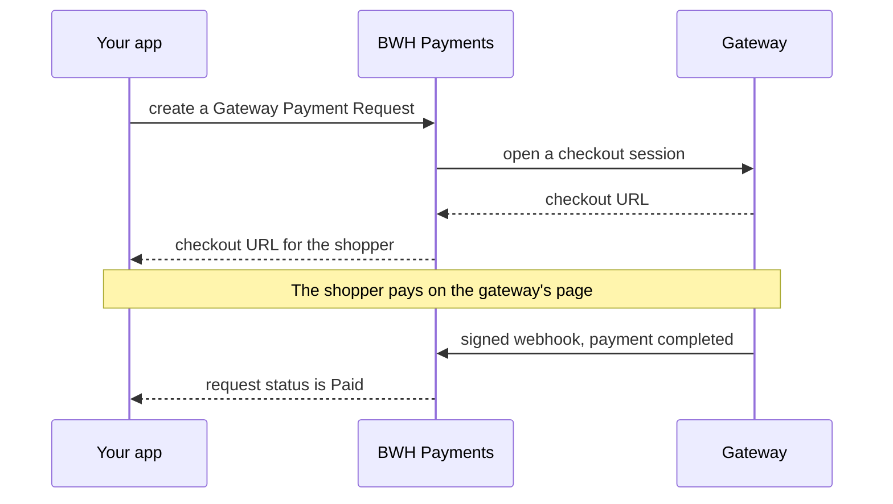

<div align="center" markdown="1">


<h1>BWH Payments</h1>

<a href="https://buildwithhussain.com"></a>

**Online payments for Frappe apps, through hosted checkout pages**

<p>
	
	
	
	
</p>

</div>

BWH Payments lets a Frappe app take payments through Stripe, Razorpay, Telr or Tabby, using the same code
for every gateway. Read the **[developer docs](https://bwhdocs.fsn.frappe.cloud/bwh-payments/get-started/overview)**.

### Gateways

- **Stripe**: cards and wallets, worldwide
- **Razorpay**: cards, UPI, netbanking and wallets in India
- **Telr**: cards and local payment methods in the GCC
- **Tabby**: buy now, pay later in Saudi Arabia, the UAE, Kuwait, Bahrain and Qatar

### Features

- Hosted checkout pages, so card details never touch your site
- Payment status from signed webhooks, or by asking the gateway directly
- Full and partial refunds
- Currencies with 0, 2 or 3 decimal places, such as JPY, USD and KWD
- Add your own gateway with one Python class
- Works without ERPNext. With ERPNext, refund Payment Entries also refund the gateway.

### How it works



### Installation

You need Frappe 16 or later.

```bash
bench get-app https://github.com/bwhtech/bwh_payments
bench --site your.site install-app bwh_payments
```

Then [set up a gateway](https://bwhdocs.fsn.frappe.cloud/bwh-payments/gateways/stripe) and
[build your return pages](https://bwhdocs.fsn.frappe.cloud/bwh-payments/get-started/return-pages).

### Adding a gateway

Create a Single DocType in your own app, extend `PaymentGatewayBase`, and implement `create_session`,
`get_payment_status`, `refund_payment` and `handle_webhook`. The
[step-by-step guide](https://bwhdocs.fsn.frappe.cloud/bwh-payments/build/build-a-payment-gateway) walks
through it, tests included.

### Development

```bash
bench --site test_site set-config allow_tests true
bench --site test_site run-tests --app bwh_payments
```

### Support

Found a bug or have a question? [Open an issue](https://github.com/bwhtech/bwh_payments/issues).

## About BWH Studios

BWH Payments is developed and maintained by BWH Studios, a tech company based in Jagdalpur, Chhattisgarh,
specializing in Frappe customizations and consulting.

#### License

MIT
