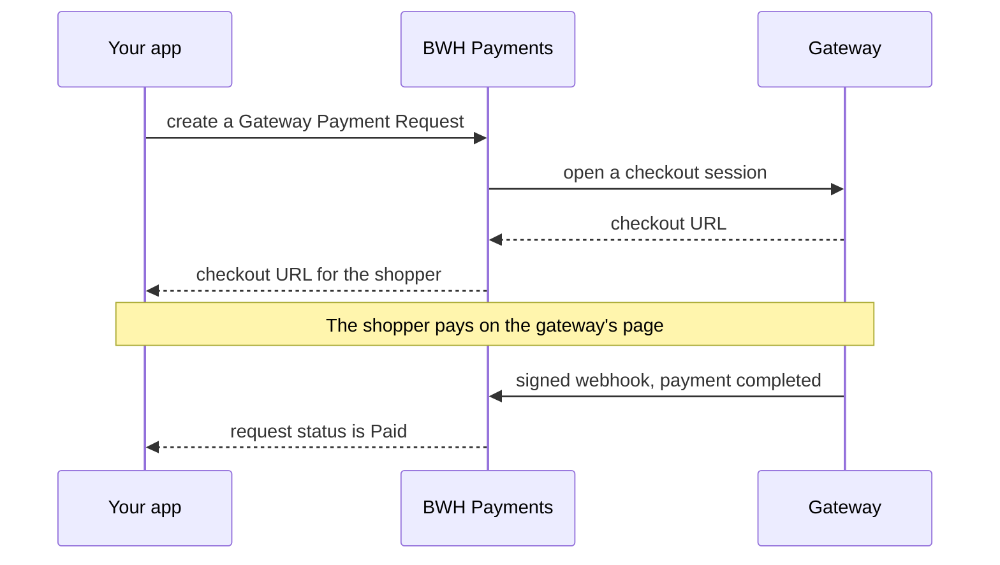

<div align="center" markdown="1">


<h1>BWH Payments</h1>

<a href="https://buildwithhussain.com"></a>

**Online payments for Frappe apps, through hosted checkout pages**

<p>
	
	
	
	
</p>

</div>

BWH Payments lets a Frappe app take payments through Stripe, Razorpay, Telr, Tabby or PayPal, using the
same code for every gateway. Read the **[developer docs](https://docs.bwh.tech/bwh-payments/get-started/overview)**.

### Gateways

- **Stripe**: cards and wallets, worldwide
- **Razorpay**: cards, UPI, netbanking and wallets in India
- **Telr**: cards and local payment methods in the GCC
- **Tabby**: buy now, pay later in Saudi Arabia, the UAE, Kuwait, Bahrain and Qatar
- **PayPal**: PayPal wallet payments in supported currencies

### Features

- Hosted checkout pages, so card details never touch your site
- Payment status from signed webhooks, or by asking the gateway directly
- Full and partial refunds
- Currencies with 0, 2 or 3 decimal places, such as JPY, USD and KWD
- Add your own gateway with one Python class
- Works without ERPNext. With ERPNext, refund Payment Entries also refund the gateway.

### How it works



### Installation

You need Frappe 16 or later.

```bash
bench get-app https://github.com/bwhtech/bwh_payments
bench --site your.site install-app bwh_payments
```

Then [set up a gateway](https://bwhdocs.fsn.frappe.cloud/bwh-payments/gateways/stripe) and
[build your return pages](https://bwhdocs.fsn.frappe.cloud/bwh-payments/get-started/return-pages).

### PayPal

Fill in `PayPal Gateway Settings` with a client ID, client secret and webhook ID for the selected
Sandbox or Live mode. Create and enable a `Payment Gateway Profile` named `PayPal` that points to those
settings. Configure the PayPal webhook at
`POST /api/method/bwh_payments.bwh_payments.webhook.handle?gateway=PayPal` and subscribe to
`CHECKOUT.ORDER.APPROVED` and `PAYMENT.CAPTURE.COMPLETED`.

PayPal cannot settle in **SAR, AED, KWD, BHD, QAR or INR**. On a Gulf storefront that means it must not
be offered on the home currency at all, which is what `get_supported_currencies` is for — the checkout
page filters on it, so a PayPal profile simply does not appear on an SAR cart.

PayPal authorises and captures separately, like Tabby. `get_payment_status` captures an approved order
before reporting it Paid, **and** the `CHECKOUT.ORDER.APPROVED` webhook captures too, so a shopper who
approves on PayPal and never comes back to the storefront is still charged. Both paths race on every
ordinary checkout; PayPal answers the loser `ORDER_ALREADY_CAPTURED`, which the controller treats as the
other call having succeeded rather than as a failure.

PayPal signs its webhooks with a certificate rather than a shared secret, so there is nothing to verify
locally: every delivery is verified by calling `POST /v1/notifications/verify-webhook-signature` back at
PayPal. That needs the **Webhook ID** from the PayPal dashboard, which is an identifier and not a secret.

Amounts go to PayPal as major-unit decimal strings. HUF and TWD are two-decimal currencies under ISO
4217 but whole-only at PayPal, so a fractional charge in them is refused rather than rounded.

The stock `frappe/payments` app ships its own `PayPal Settings` on the deprecated NVP/Classic API. It is
unrelated to this one and does not implement the contract. Because `payments.utils.create_payment_gateway`
is a no-op when the row already exists, a site that ever saved that Single has a `Payment Gateway` row
named `PayPal` pointing at it, and creating this profile will **not** repoint it — check that row.

### Adding a gateway

Create a Single DocType in your own app, extend `PaymentGatewayBase`, and implement `create_session`,
`get_payment_status`, `refund_payment` and `handle_webhook`. The
[step-by-step guide](https://bwhdocs.fsn.frappe.cloud/bwh-payments/build/build-a-payment-gateway) walks
through it, tests included.

Amounts passed to these methods are in major units. A gateway with a fixed currency list can implement
`get_supported_currencies` to filter checkout options, and must also validate the currency in
`create_session`.

### Development

```bash
bench --site test_site set-config allow_tests true
bench --site test_site run-tests --app bwh_payments
```

They run against fake transports (`bwh_payments/tests/fake_stripe.py`, `fake_razorpay.py`,
`fake_paypal.py`) with real signature verification — no live gateway calls, ever.

### Support

Found a bug or have a question? [Open an issue](https://github.com/bwhtech/bwh_payments/issues).

## About BWH Studios

BWH Payments is developed and maintained by BWH Studios, a tech company based in Jagdalpur, Chhattisgarh,
specializing in Frappe customizations and consulting.

#### License

MIT
